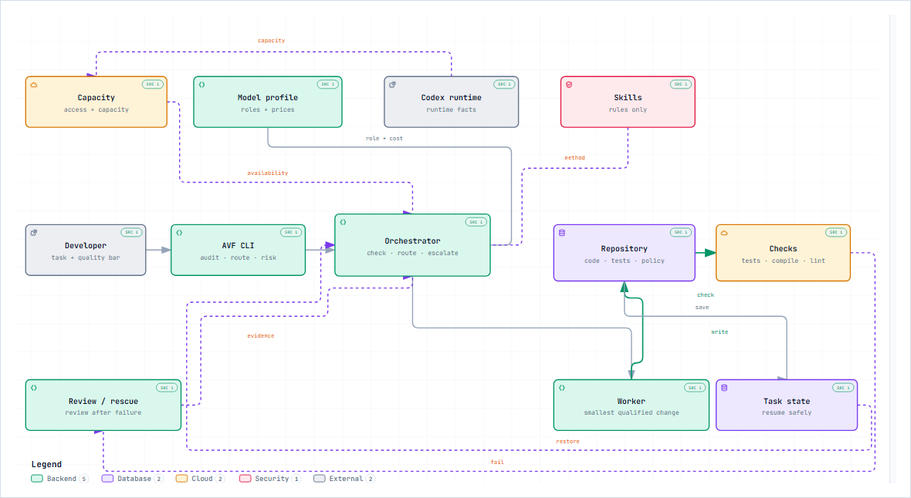
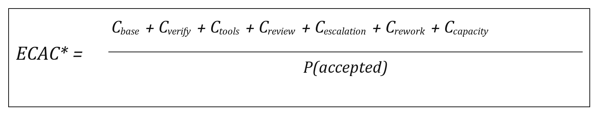

# Agent Value Framework (AVF) for OpenAI Codex

Cost-aware routing for coding work in OpenAI Codex and OpenAI models.

AVF checks whether a route is allowed and capable, then chooses the lowest expected cost per accepted change.



The diagram shows the path from task to accepted change: check capacity, route work, write to the repository, run checks, then review or rescue only when evidence requires it. Open the [full architecture diagram](docs/agent-value-framework-architecture.html) for the source-linked version.

## What AVF does

- Routes work between an orchestrator, workers, reviewers and rescue paths.
- Checks entitlement, capacity, capability, policy and the quality bar before price.
- Measures expected cost per accepted change, not token price alone.
- Keeps task state recoverable across compaction and model changes.

The core is provider-neutral. The reference setup and examples are for OpenAI Codex and OpenAI models.

## The ECAC formula

[](docs/MATH.md)

**ECAC = expected cost for one attempt ÷ probability the change is accepted.**

| Term | Meaning |
| --- | --- |
| `C_base` | Model work for one attempt, including planning and workers. |
| `C_verify` | Expected cost of tests, lint, compile and other checks. |
| `C_tools` | Expected cost of tools or hosted services. |
| `C_review` | Expected reviewer cost when review is used. |
| `C_escalation` | Expected cost of a stronger model or rescue path. |
| `C_rework` | Expected retry and fix cost after failure. |
| `C_capacity` | Project-assigned scarcity cost for using a limited capacity pool; can be zero. |
| `P(accepted)` | Project evidence for the chance that the change meets its quality bar and is accepted. |

Use project telemetry for `P(accepted)`. A public benchmark score is not an acceptance probability.

## Install

Requires Python 3.11+. Runtime dependencies: none.

```bash
python -m pip install "git+https://github.com/Bashyr18/agent-value-framework.git"
avf --help
```

On Windows, use `py -m pip` if `python` is not available. For local development:

```bash
git clone https://github.com/Bashyr18/agent-value-framework.git
cd agent-value-framework
python -m pip install -e .
```

## First checks

Run these in the repository where Codex will work:

```bash
avf audit .
avf doctor .
```

`audit` is read-only. `doctor` checks prerequisites for an AVF/Codex integration.

## OpenAI Codex setup

Codex is the execution runtime. AVF supplies routing rules and checks; it does not call the OpenAI API, change Codex settings or read private quota.

The dated example profile in [`examples/openai-codex-money-first/`](examples/openai-codex-money-first/) uses:

```text
root      GPT-5.6 Sol
worker    GPT-5.6 Luna
review    GPT-5.6 Terra
rescue    GPT-5.6 Sol
adviser   GPT-6 Astra
```

These are example roles, not permanent AVF defaults. Read [`docs/CODEX.md`](docs/CODEX.md) before adding project-local Codex configuration.

### Luna Reserve

Reserve is a runtime fallback, not proof that a model is available.

1. Confirm regular capacity is unavailable and Reserve is explicitly confirmed.
2. Save a checkpoint and reclassify the remaining work.
3. Continue only if the fallback preserves the quality bar; pause unsafe work.

Never infer Reserve from an effective `gpt-5.6-luna` model name. See the [OpenAI Luna Reserve guidance](https://help.openai.com/en/articles/20001499-luna-reserve-in-codex-and-chatgpt-work) and [`docs/CAPACITY.md`](docs/CAPACITY.md).

## Common commands

Calculate ECAC:

```bash
avf ecac --base-cost 0.30 --verification-cost 0.05 --accept-prob 0.75
```

Add project-assigned scarcity cost:

```bash
avf ecac --base-cost 0.30 --accept-prob 0.75 --capacity-opportunity-cost 0.10
```

Check capacity evidence:

```bash
avf capacity --regular available --reserve unknown
```

Score task risk:

```bash
avf risk --ambiguity 0.2 --blast-radius 0.3 --coupling 0.2
```

See the [CLI reference](docs/CAPACITY.md) and [math model](docs/MATH.md) for the remaining commands.

## Routing rule

```text
1. Is the route entitled, available and capable?
2. Does it meet the project's quality bar?
3. Among feasible routes, which has the lowest ECAC?
4. If capacity changes, checkpoint and reclassify.
```

Unknown runtime facts never become permission. A fallback never lowers the quality bar.

## Add AVF to a project

Do not overwrite the target project's instructions, hooks, CI, skills or settings.

```bash
avf audit /path/to/target-repository
```

Give the audit to your coding agent and follow [`docs/AGENT_ADOPTION.md`](docs/AGENT_ADOPTION.md). For a new project, start with [`docs/NEW_PROJECT.md`](docs/NEW_PROJECT.md).

## Documentation

- [Capacity and fallback](docs/CAPACITY.md)
- [ECAC and routing math](docs/MATH.md)
- [Architecture](docs/ARCHITECTURE.md)
- [Codex integration](docs/CODEX.md)
- [Context recovery](docs/CONTEXT_COMPACTION.md)
- [OpenAI/Codex profile](examples/openai-codex-money-first/)

## Boundaries

AVF does not scrape quotas, read private chain-of-thought, replace tests with model judgment, turn benchmarks into acceptance probabilities, lower the quality bar or deploy changes automatically.

## Status

`0.2.0` is on `main` as an unreleased capacity-aware update. The v0.1.0 tag and release remain intact.

## License

MIT.
